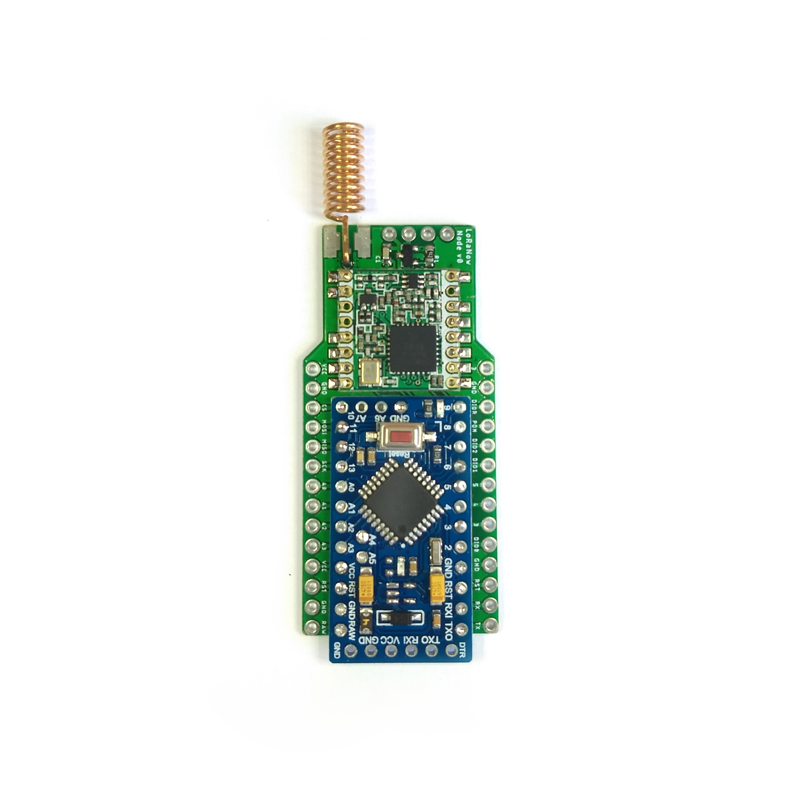

# LoRaNow v0

LoRaNow Boards v0 is a PCB to help wiring between Arduino Mini and RFM95 LoRa module to work with 2 AA batteries.

## Detailed Description

This board has:
* Footprint for Arduino Pro Mini
* Footprint for RFM95
* Footprint for P-Channel Mosfet to turn on/off the RFM95
* Classic I2C connector (VCC, GND, SCL, SDA)

Look at the schematics for more informations.

## Schematic

## License

 This work is licensed under a <a rel="license" href="http://creativecommons.org/licenses/by-nc-sa/4.0/">Creative Commons Attribution-NonCommercial-ShareAlike 4.0 International License</a>.

If you want to do commercial stuff with this project, please contact [ricaun][1] so we can organize an simple agreement.

## Blog

See news and other projects on my [blog][2] 

[1]: http://www.ricaun.com.br/#contact
[2]: http://www.loranow.com