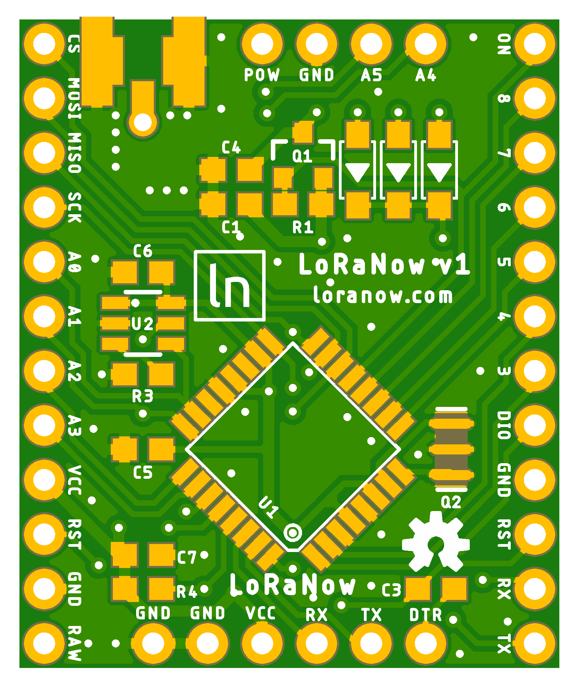
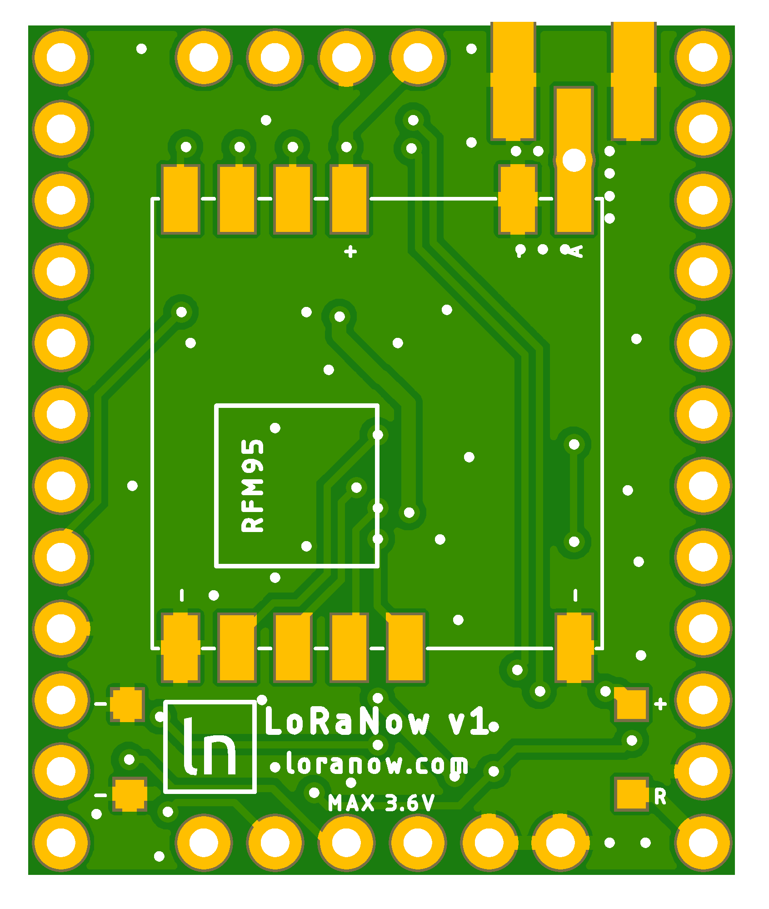

# LoRaNow v1

LoRaNow Boards v1 is a PCB to help wiring between Atmega328p and RFM95 LoRa module to work with 2 AA batteries.


## Detailed Description

This board has:
* Footprint for Atmega328p
* Footprint for RFM95
* Footprint for P-Channel Mosfet to turn on/off the RFM95
* Classic I2C connector (VCC, GND, SCL, SDA)
* Footprint for Diodes (DIO0/DIO1/DIO2 to pin 2)
* Footprint for Ultra Low Power controller TPL5110 (Optional)

Look at the schematics for more informations.

Pins board connections.
```
  Arduino       RFM9x Module
  13 <--------> CLK
  12 <--------> MISO
  11 <--------> MOSI
  10 <--------> CS
  9  <--------> P-MOSFET
  2  <-DIODES-> DIO0/DIO1/DIO2
```

## Schematic


## Boards



## Bill Of Material

* Atmega328p (SMD)
* 8MHz cystal (SMD)
* RFM95 (check Frequency)
* Resistor 10k (603) (x2)
* Capacitor 1u (603)
* Capacitor 0.1u (603) (x5)
* P-Channel Mosfet (SOT23)
* 1N4148 (SOD123) (x3)
* Ultra Low Power controller TPL5110
* Resistor 124k (603)
* Battery holder (2xAA)
* Antenna 

## License

<a rel="license" href="http://creativecommons.org/licenses/by-nc-sa/4.0/"></a><br />This work is licensed under a <a rel="license" href="http://creativecommons.org/licenses/by-nc-sa/4.0/">Creative Commons Attribution-NonCommercial-ShareAlike 4.0 International License</a>.


If you want to do commercial stuff with this project, please contact [ricaun][1] so we can organize an simple agreement.

## Blog

See news and other projects on my [blog][2] 

[1]: http://www.ricaun.com.br/#contact
[2]: http://www.loranow.com